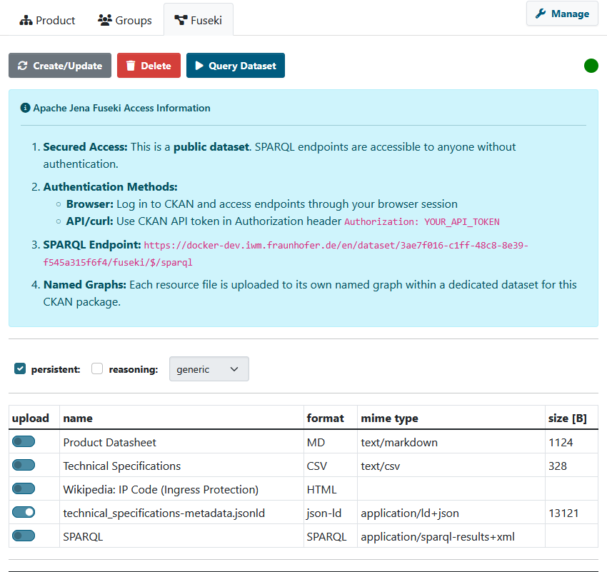

[](https://github.com/Mat-O-Lab/ckanext-fuseki/actions/workflows/test.yml)

# ckanext-fuseki

Extension creates a new tab in the dataset view that enables you to upload selected resources to a connected jena fuseki triple store. 



## Requirements

* **Apache Jena Fuseki** server with custom security configuration (see [Deployment](#deployment) section)
* **CKAN API Token** with admin privileges for background job processing of private datasets

### Fuseki Deployment

This extension requires a **custom Fuseki deployment** with modified security settings to enable CKAN-authenticated access. The necessary files are provided in the `optional/` folder:

- **`optional/fuseki/Dockerfile`** - Custom Fuseki image based on `secoresearch/fuseki:4.9.0`
- **`optional/fuseki/docker-entrypoint.sh`** - Security wrapper that blocks anonymous dataset access
- **`optional/fuseki/index.html`** - Fixed Fuseki UI for subpath deployment
- **`optional/docker-compose.yml`** - Example standalone deployment configuration

See the [optional/README.md](optional/README.md) for standalone deployment instructions, or integrate into your existing Docker Compose setup (see [Deployment](#deployment) section below).

**Optional**: A Sparklis web app for interactive SPARQL querying is also available in the optional folder.

## Purpose

ckanext-fuseki is an extension for enabling the semantic aspect of CKAN with Apache Jena.

This extension provides an ability to let users store a set of semantic resource (e.g. rdf, ttl, owl) in Apache Jena and perform SPARQL semantic queries.

### Security Features

The extension now includes **CKAN-authenticated access** to Fuseki SPARQL endpoints:
- All dataset access is proxied through CKAN with permission checks
- Public datasets: accessible to anyone via CKAN proxy
- Private datasets: requires CKAN authentication (API token or session)
- Direct Fuseki access: blocked for anonymous users, admin-only

See [SECURITY.md](SECURITY.md) for detailed information about the security architecture and deployment.

### Notes:

Compatibility with core CKAN versions:

| CKAN version    | Compatible?   |
| --------------- | ------------- |
| 2.9 and earlier  | not tested    |
| 2.10             | yes    |
| 2.11            | yes    |


## Installation

### 1. Install the Extension

**From PyPI:**
```bash
pip install ckanext-fuseki
```

**From Source:**
```bash
pip install -e git+https://github.com/Mat-O-Lab/ckanext-fuseki.git#egg=ckanext-fuseki
```

### 2. Deploy Fuseki with Security Configuration

This extension requires Fuseki with a custom entrypoint wrapper that blocks anonymous access.

**Option A: Mount Entrypoint (Simpler - No Build Required)**

```yaml
services:
  fuseki:
    image: secoresearch/fuseki:4.9.0
    entrypoint: /custom-entrypoint.sh
    environment:
      - ADMIN_PASSWORD=${FUSEKI_PASSWORD}
      - JAVA_OPTIONS=-Xmx10g -Xms10g -DentityExpansionLimit=0
      - ENABLE_DATA_WRITE=true
      - ENABLE_UPDATE=true
      - ENABLE_UPLOAD=true
      - QUERY_TIMEOUT=60000
    volumes:
      - ./path/to/ckanext-fuseki/optional/fuseki/docker-entrypoint.sh:/custom-entrypoint.sh:ro
      - jena_data:/fuseki-base
    networks:
      - your_network
    healthcheck:
      test: ["CMD-SHELL", "wget -qO /dev/null http://localhost:3030/$$/ping || exit 1"]
      interval: 10s
      timeout: 5s
      retries: 3
```

**Option B: Build Custom Image (includes fixed index.html for subpaths)**

```yaml
services:
  fuseki:
    build:
      context: path/to/ckanext-fuseki/optional/fuseki/
    environment:
      - ADMIN_PASSWORD=${FUSEKI_PASSWORD}
      - JAVA_OPTIONS=-Xmx10g -Xms10g -DentityExpansionLimit=0
      - ENABLE_DATA_WRITE=true
      - ENABLE_UPDATE=true
      - ENABLE_UPLOAD=true
      - QUERY_TIMEOUT=60000
    volumes:
      - jena_data:/fuseki-base
    networks:
      - your_network
    healthcheck:
      test: ["CMD-SHELL", "wget -qO /dev/null http://localhost:3030/$$/ping || exit 1"]
      interval: 10s
      timeout: 5s
      retries: 3
```

**Start Fuseki:**
```bash
# Option A - no build needed
docker-compose up -d fuseki

# Option B - build first
docker-compose build fuseki && docker-compose up -d fuseki
```

### 3. Configure CKAN

Add `fuseki` to the `ckan.plugins` setting in your CKAN config file:

```ini
ckan.plugins = ... fuseki
```

### 4. Restart CKAN

```bash
docker-compose restart ckan
# Or for Apache deployment:
sudo service apache2 reload
```

## Config settings

```bash
FUSEKI_CKAN_TOKEN=${CKAN_API_TOKEN}
CKANINI__CKANEXT__FUSEKI__URL = http://<fuseki_host>:<fuseki_port>/
CKANINI__CKANEXT__FUSEKI__USERNAME = <admin_user>
CKANINI__CKANEXT__FUSEKI__PASSWORD = *****
```
or ckan.ini parameters.
```bash
ckan.jena.fuseki.url = http://<fuseki_host>:<fuseki_port>/
ckan.jena.fuseki.username = <admin_user>
ckan.jena.fuseki.password = *****
```
If no Api Token is given, only public resources can be uploaded to the triple store!

You can set the default formats to preselected for upload by setting the formats,
```bash
CKANINI__CKANEXT__FUSEKI__FORMATS = 'json turtle text/turtle n3 nt hext trig longturtle xml json-ld ld+json'
```
else it will react to the listed formats by default

if a sparklis web app is available, you can set
```bash
CKANINI__CKANEXT__FUSEKI__SPARKLIS__URL = http://<sparklis_host>:<sparklis_port>/
```
the query button will redirect to sparklis instead.

# Acknowledgements

This project's work is based on a fork of the repo [etri-odp/ckanext-jena](https://github.com/etri-odp/ckanext-jena), and we like to thank the authors of that project for sharing their work.
It was supported by Institute for Information & communications Technology Promotion (IITP) grant funded by the Korea government (MSIT) (No.2017-00253, Development of an Advanced Open Data Distribution Platform based on International Standards)
